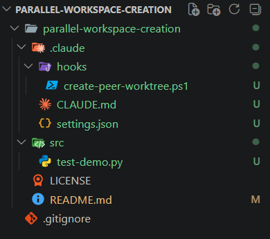
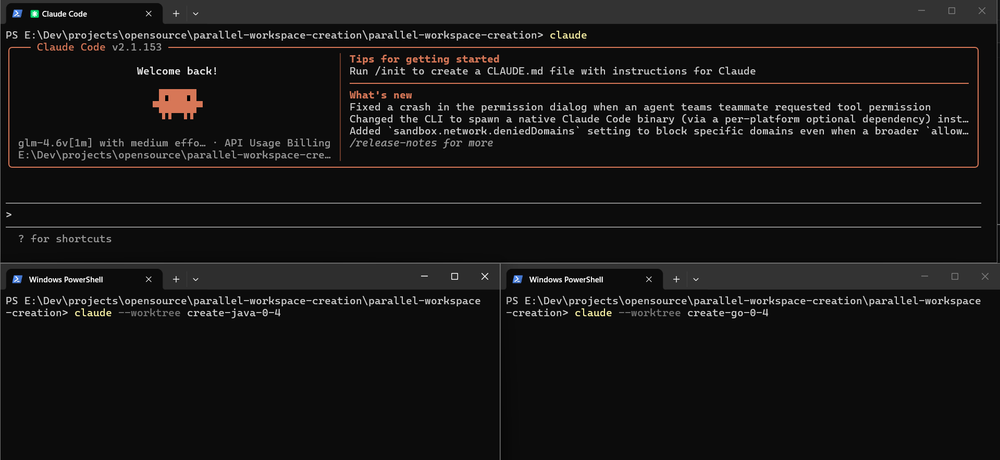
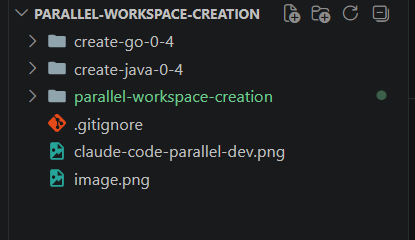
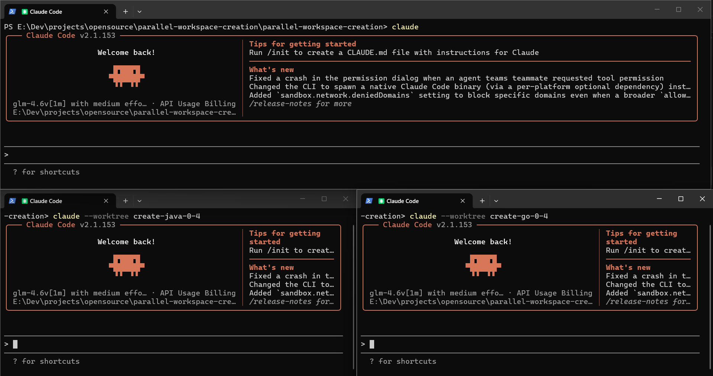
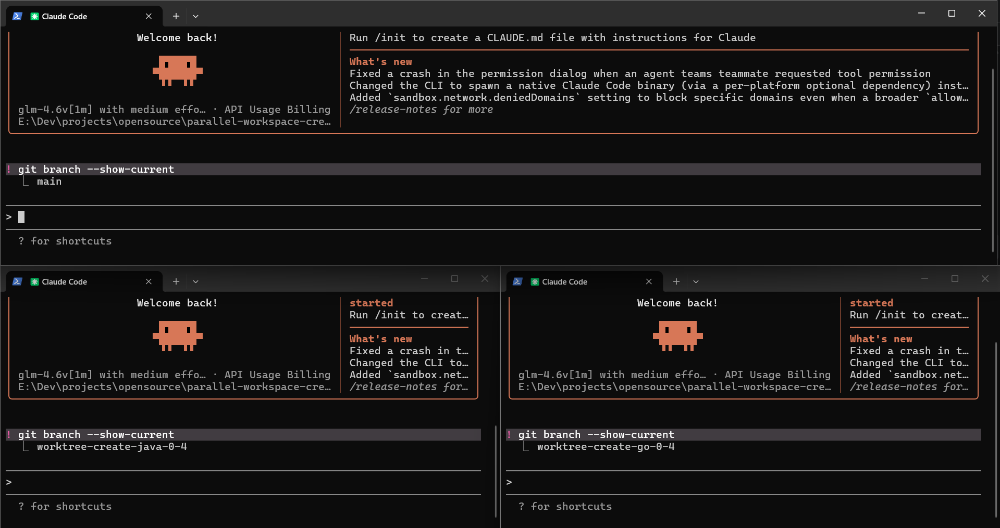
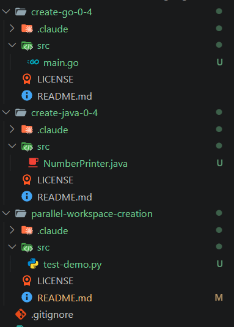
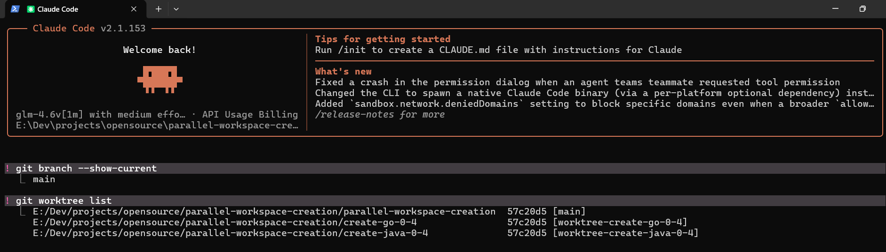
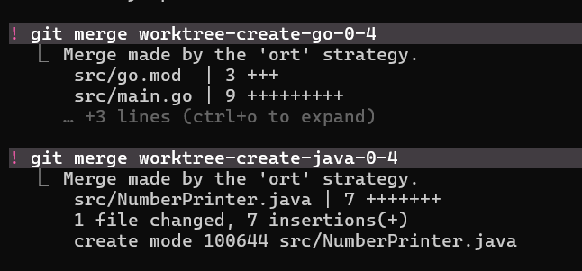
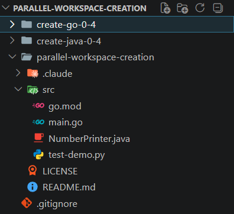
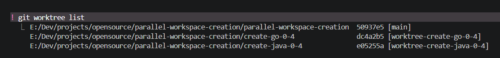

# 同级工作区创建——并行开发
借助WorktreeCreate钩子函数，可让 Claude Code 管理工作树分支，同时将各工作树分支存放至与主仓库同级的父目录下，便于项目开发。

## 为什么使用它 ?
如果使用Claude Code（以下简称cc） 默认的Worktree分支进行并行开发的话，cc默认会把创建出来的工作区项目文件放到主仓库下的.claude/worktree/ 下面，类似于下面这种格式：
~~~
my-app/
└── .claude/
    └── worktrees/
        └── test-login-bug/
~~~
这种方式的优点是：Claude Code 管理起来方便，退出 session 时也可能帮你处理清理流程，适合场景：临时任务、短期 bugfix、让 Claude Code 自己创建、自己清理、不需要你长期手动管理。

缺点是：这些 worktree 藏在 .claude/ 下面，不如平级目录直观。你如果经常用 IDE 单独打开某个 worktree，路径会稍微深一点。

但是，如果是你要长期自己管理的并行开发，比如一个功能要做几天，可以通过git手动建平级 worktree。但是这样子后期如果手动创建太多分支，并且需要快速删除的话，又会显得很繁琐。因此可以使用这个项目下的一个hook函数脚本：`create-peer-worktree.ps1`结合cc和平级管理的工作区项目代码的优点。

## 示例：使用cc并行开发项目
### 通过这个hook脚本创建平级工作区
这边假设`parallel-workspace-creation`为主仓库代码。里面`src`文件夹下面存放的是一个输出0-4数字的python代码文件。


这时候假设我要并行开发一个输出0-4的java代码和一个输出0-4的go代码时候我需要创建两个分支。并且合并到主仓库下面，实现整合。这时候可以先新开两个powershell终端，一个用来开发java代码，一个用来开发go代码。具体示例如下图所示。


要创建并行开发功能的 Claude Code CLI 终端，你可以创建对应的项目功能名字表示要处理的功能是什么，回车之后能看到工作区里面的代码自动创建好了与主仓库同级的工作区项目代码。

这里在运行这个.claude/hooks 下的钩子函数`parallel-workspace-creation/.claude/hooks/create-peer-worktree.ps1`时。需要设置本项目的 Settings.json 文件的参数，这是因为 Claude Code 它默认用它的 Worktree 创建的工作树项目，这样子会变成跟cc默认的工作区项目代码创建方式相同，而且如果是远程和本地都有项目代码，优先会从远程拉取仓库的稳定代码的。我们要让它能够拉取本地的代码，需要调整参数。在主仓库下的.claude/文件夹下面创建`parallel-workspace-creation/.claude/settings.json`里面配置好hooks。

示例项目最开始的工作区样子如下图所示：


准备工作就绪之后，可以在各自的终端中输入以下命令：
第一个主Agent开发终端
```powershell
cd .\parallel-workspace-creation\
claude
```
第二个副Agent并行开发的分支---java代码
```powershell
cd cd .\parallel-workspace-creation\
claude --worktree create-java-0-4
```
第三个副Agent并行开发的分支---go代码
```powershell
cd cd .\parallel-workspace-creation\
claude --worktree create-go-0-4
```
初期准备工作类似于这样，这里为了更好展示我如下图布局，实际上可以多开很多个工作树分支并行开发，并且互相不受影响。

当我们把分支的命令回车之后，可以发现当前工作区主仓库同等级下面会有对应分支的工作树代码。



然后我们可以直接查看各自终端分别处于什么分支下面：

能够看到不同的 Worktree 名称，它对应的一个分支的情况都是不相同的，并且它对应的一个工作区项目代码也是不同的。

### 并行开发过程（这里以创建java和go代码文件为例）

这时候我要开始并行开发了，我在java分支说：请用java代码写一个输出0-4数字的代码文件，写在`src`文件夹下面

在go分支说：请用go代码写一个输出0-4数字的代码文件，写在`src`文件夹下面

此时对应分支与Claude Code对应一一对话，这样之后工作区各自文件夹下面会多出对应对话的文件，如下图所示：

可以看到在 Go 分支和 Java 分支对应的文件夹下面，都多出了一个文件，分别是 main.go 文件和 NumberPrinter.java 文件。
并且测试了一下运行均能够成功。因此，分支并行开发功能成功。接下来是要合并到主分支上，实现整合，当前这个java输出0-4以及go输出0-4要整合到主仓库`parallel-workspace-creation`中，实现整合。

首先各自分支功能开发好之后，应该先进行一次分支的 commit 提交。将对应 Worktree 的未跟踪代码提交到对应分支的一个 Git 历史记录中，才能够进行合并。两个分支都需要运行以下Git命令，在cc的cli界面里面，记得前面先用!调整识别对应命令。
```
git add .
git commit ".."
```


然后切换到主Agent的Powershell终端窗口，然后使用Git命令进行合并，首先先查看一下工作树分支
```
git worktree list
```

然后一定要切换到主分支进行合并，在终端之前使用!可切换使用终端指令。


最终可以看到主仓库代码整合了go代码文件和java代码文件。这样子就成功实现了并行开发。


如果你之后不想要这两个长期的分支的话，可以运行如下命令删除它们。
```powershell
cd parallel-workspace-creation（Go to the main repository directory）

git worktree remove <sub-path-name> --force
git branch -D <branch-name>

```
以下面为例

拿取自己本地对应的信息，进行处理。

## LINCENSE
[MIT](./LICENSE)


